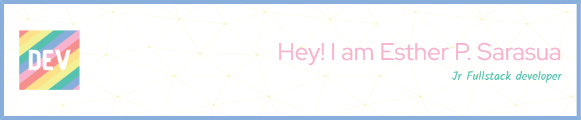

# 💫 About Me:
🔭 I’m currently working on: A crypto market screener and alert system with a Polymarket maker bot, built with Python, FastAPI, Next.js, and PostgreSQL.  👯 I’m looking to collaborate on: Web development projects, particularly in backend and fullstack development with React, Python, and Typescript.  🤝 I’m looking for help with: Improving my skills in backend optimization and performance for large-scale web apps.  🌱 I’m currently learning: Advanced React techniques, Typescript, Next, and back-end architecture with Django and PostgreSQL.  💬 Ask me about: My experience in full-stack web development, hackathons, and anything related to early queer house music or poetry authors!  

# 🌐 How to reach me:
 
 

# 💻 Tech Stack:
                     
# 📊 GitHub Stats:
 
 

### 🔝 Top Contributed Repo

---

